# fs-lab — System Overview

## 🔗 Live Frontend

#### Exploratory access (manual testing and visualization only):

#### [Frontend on Render](https://fs-lab-core-react.onrender.com/)

## 🎯 Project Goal

fs-lab is a multi-service system designed to benchmark and analyze cold and warm start behavior across different backend runtimes (Node.js, Python, Go) hosted on the same platform.

The project focuses on measuring real-world latency, platform-induced variance, and startup characteristics under identical conditions. All measurements are collected automatically, stored centrally, and analyzed asynchronously.

The goal is not to compare languages in isolation, but to understand how runtime, platform, and deployment characteristics interact in practice.

## 🧩 System Architecture

The system consists of multiple independently deployed backend services, a central data store, asynchronous analysis jobs, and a static frontend.

Each backend service exposes an identical health endpoint and is deployed on the same hosting platform to ensure comparable conditions. Backend endpoints can be triggered both by automated benchmarking workflows and manually via the frontend for interactive inspection.

Automated benchmarking is executed via scheduled GitHub workflows that record detailed timing information under controlled conditions. Manual frontend-triggered requests are intended for exploratory testing and are not used as primary benchmarking data.

All measurements are persisted in a central PostgreSQL database (Supabase). Analysis and machine learning are executed asynchronously in batch jobs and never interfere with request handling or benchmarking.

The frontend is a static application that visualizes raw measurements and derived analysis results.

## 🗺️ Architecture Diagram

```mermaid
flowchart LR
    Cron[⏱️ GitHub Cronjob<br/>Benchmark]
    FE_Test[🖥️ Frontend<br/>Manual Tests]
    BE[⚙️ Backends<br/>Go · Node · Python]
    DB[(🗄️ Supabase<br/>PostgreSQL)]
    ML[🤖 ML / Analysis<br/>Batch Jobs]
    FE_View[🌐 Frontend<br/>Visualization]

    Cron --> BE
    FE_Test --> BE
    BE --> DB
    DB --> ML
    ML --> DB
    DB --> FE_View
```

## ⚙️ Components

The system is composed of multiple independent repositories, each with a clearly defined responsibility.

### 🖥️ Backends

Identical backend services implemented in different runtimes and deployed under the same conditions.  
Each service exposes a simple health endpoint used for benchmarking.

- 🟡 **Node.js Backend**  
  Repository: [fs-lab-core-api-node](https://github.com/fs-lab-system/fs-lab-core-api-node)
  Purpose: Measure startup and runtime characteristics of a JavaScript-based server environment.

- 🔵 **Python Backend**  
  Repository: [fs-lab-core-api-python](https://github.com/fs-lab-system/fs-lab-core-api-python)
  Purpose: Measure interpreter-based startup overhead and runtime variance.

- 🟢 **Go Backend**  
   Repository: [fs-lab-core-api-go](https://github.com/fs-lab-system/fs-lab-core-api-go)  
   Purpose: Measure cold and warm start behavior of a compiled, statically linked runtime.

---

### ⏱️ Benchmark & Cronjobs

Automated benchmarking is executed via GitHub Actions workflows.  
These workflows periodically trigger backend endpoints and record detailed timing metrics.

- ⏱️ **Benchmark Cronjobs**  
  Repository: [fs-lab-cron](https://github.com/fs-lab-system/fs-lab-cron)
  Purpose: Execute scheduled measurements and persist results to the central database.

---

### 🤖 ML / Analysis

Offline analysis and machine learning are executed asynchronously and are fully decoupled from request handling.

- 📈 **ML Analysis Jobs**  
  Repository: [fs-lab-ml](https://github.com/fs-lab-system/fs-lab-ml)
  Purpose: Detect anomalies, identify patterns, and derive cold start probabilities from collected data.

---

### 🌐 Frontend

A static frontend application used for visualization and manual exploration.

- 🌐 **Frontend**  
  Repository: [fs-lab-core-react](https://github.com/fs-lab-system/fs-lab-core-react)  
  Purpose: Visualize raw measurements, analysis results, and enable manual endpoint testing.

## 🔄 Data Flow

The system distinguishes between two different request paths: automated benchmark measurements and manual exploratory requests.

Automated measurements are executed by scheduled GitHub Actions workflows. These workflows periodically trigger the health endpoints of all backend services under controlled conditions. For each request, timing-related metadata such as total response time, timestamp, and backend identifier are collected.

The collected measurements are written directly to a central PostgreSQL database (Supabase). This dataset represents the authoritative source for all benchmarking and performance analysis.

In addition to automated measurements, the frontend allows users to manually trigger backend endpoints. These requests are intended for exploratory testing, debugging, and validation only. Results from manual requests are explicitly excluded from the primary benchmarking dataset and are not used for statistical analysis or machine learning.

All downstream analysis, aggregation, and machine learning processes operate exclusively on the automated benchmark data and are executed asynchronously.

## 📊 Metrics & Measurements

The system records a defined set of metrics to enable consistent comparison across different runtimes and execution conditions.

### Primary Metrics

- **Total Response Time (ms)**  
  End-to-end duration from request initiation to completed HTTP response.  
  This metric represents the externally observable latency and is used as the primary comparison value.

- **Timestamp**  
  UTC timestamp of the measurement, used for time-based aggregation and trend analysis.

- **Backend Identifier**  
  Logical identifier of the backend service (Go, Node.js, Python) to ensure clear attribution.

---

### Derived Metrics

- **Cold Start**  
  A request is classified as a cold start if it occurs after a defined period of backend inactivity or triggers a fresh container/runtime initialization by the hosting platform.

- **Warm Start**  
  A request handled by an already initialized and active backend instance.

- **Time Since Last Invocation**  
  Duration between the current request and the previous invocation of the same backend service.  
  This value is used as an input for cold start classification and analysis.

---

### Measurement Scope and Constraints

- Only automated benchmark measurements generated by scheduled GitHub workflows are considered authoritative.
- Manual requests triggered via the frontend are excluded from statistical analysis and machine learning.
- No application-level instrumentation or tracing is used; all measurements are based on externally observable behavior.
- Metrics are collected uniformly across all runtimes to ensure comparability.

## 🤖 Role of Machine Learning

Machine learning is used as an offline analysis tool to identify patterns and anomalies in collected benchmark data.

The purpose of machine learning in this system is not to make real-time decisions or influence request handling. Instead, ML operates exclusively on historical, authoritative benchmark data and is executed asynchronously in batch jobs.

Typical use cases include anomaly detection in cold start behavior, identification of latency clusters, and exploratory analysis of platform-induced variance.

Machine learning models do not modify system behavior, trigger scaling actions, or affect request routing. All ML results are treated as analytical insights and are consumed exclusively by visualization and reporting components.

The machine learning component is implemented incrementally and is intentionally decoupled from all runtime-critical paths.

## 🧠 Architectural Decisions

The architecture of this system is intentionally modular and loosely coupled to reflect realistic production environments.

### 🧩 Multiple Independent Services

Backend implementations are separated into individual services rather than combined into a monolithic or multi-runtime application. This allows each runtime to be deployed, started, and measured under identical platform conditions without shared state or cross-runtime interference.

### ⏱️ Asynchronous Benchmarking and Analysis

Benchmarking and machine learning are executed asynchronously and outside of the request handling path. This decision avoids measurement bias, prevents feedback loops, and ensures that observed latency reflects platform and runtime behavior rather than instrumentation overhead.

### 🗄️ Centralized, Authoritative Data Store

All benchmark data is persisted in a single PostgreSQL database which serves as the authoritative source for analysis. Derived metrics, aggregations, and machine learning results are computed downstream and never replace or modify raw measurement data.

### 🚫 No Runtime Instrumentation or Tracing

The system intentionally avoids application-level tracing, profiling, or runtime instrumentation. All measurements are based on externally observable behavior to ensure fairness and comparability across different runtimes and implementations.

### 🤖 Machine Learning as Analysis, Not Control

Machine learning is used strictly as an analytical tool. It does not influence runtime behavior, scaling decisions, or request routing, and operates exclusively on historical data in batch mode.

### 🏢 Repository Organization

Repositories are organized as independent projects within a GitHub organization to reflect a realistic multi-service setup. Each repository has a clearly defined responsibility and lifecycle, reducing coupling and improving clarity.

## 🚀 Current State

The core system architecture is implemented and operational.

Multiple backend services (Go, Node.js, Python) are deployed under identical conditions and expose a uniform health endpoint. Automated benchmark workflows are in place and continuously collect latency measurements which are persisted in a central PostgreSQL database.

The frontend provides basic visualization of collected data and supports manual endpoint testing for exploratory purposes. All manual interactions are clearly separated from automated benchmark data.

The machine learning component is currently in a preparatory phase. Data structures, measurement methodology, and architectural boundaries are defined, while model implementation and analysis workflows are planned as a subsequent step.

## 🛣️ Next Steps

Planned next steps focus on extending analytical depth while preserving measurement integrity.

- Implement offline machine learning analysis jobs for anomaly detection and pattern discovery in cold start behavior.
- Introduce derived metrics and aggregated views to enable trend analysis and percentile-based comparisons.
- Improve frontend visualization to better highlight variance, outliers, and long-term trends.
- Refine cold start classification heuristics based on empirical observations.
- Document analytical findings and observed platform behavior as the dataset grows.
